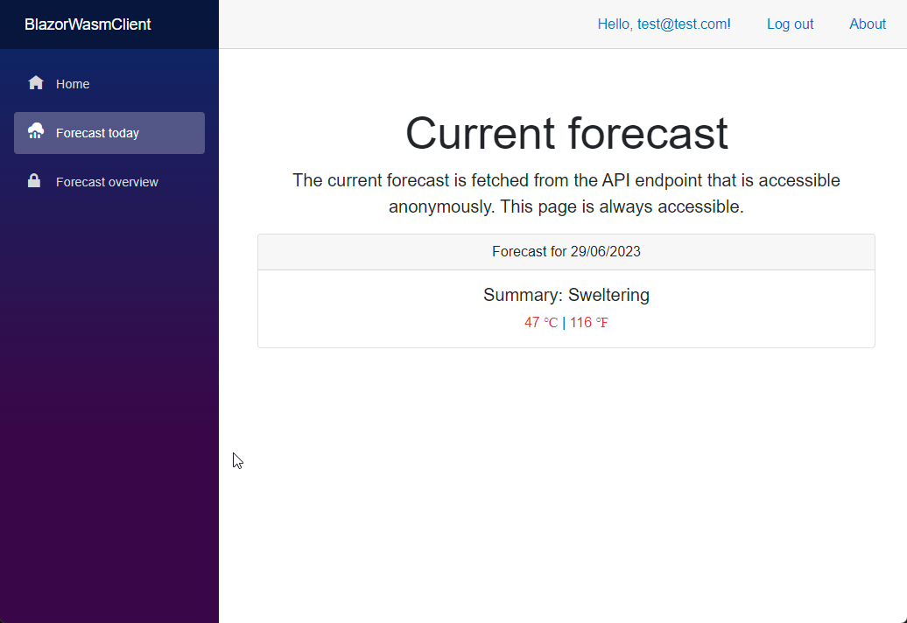
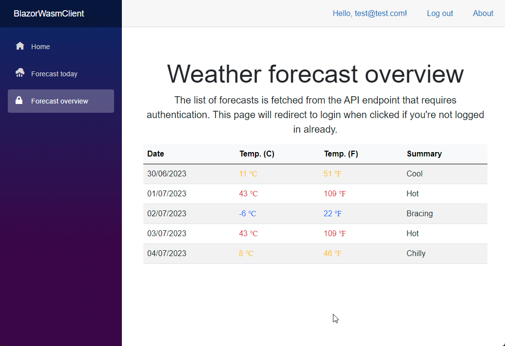
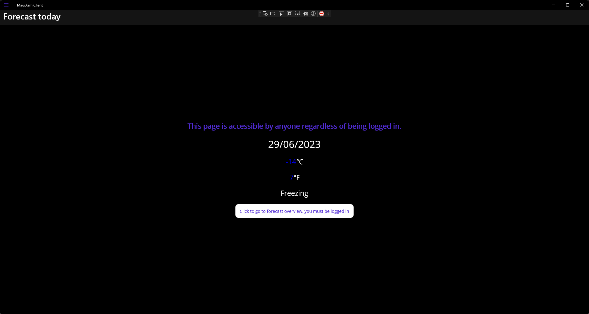
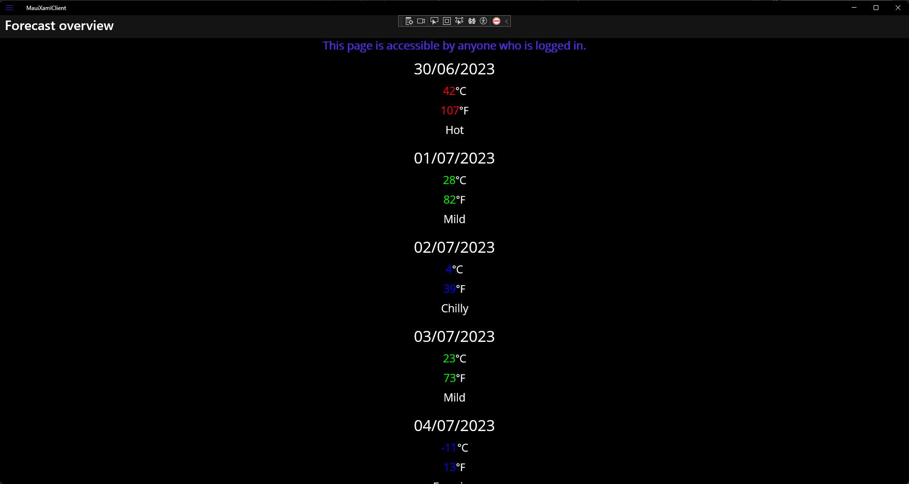
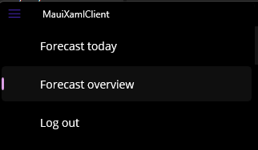

# .NET AuthenticationSamples

This is a C# project demonstrating how to implement authentication in your .NET MAUI or Blazor WebAssembly application. Since .NET MAUI still has some bugs with WebAuthenticator it can be difficult to make it work. My teacher at Avans Hogeschool asked me to write an example and a tutorial. The solution contains an API that uses IdentityServer, a Blazor WebAssembly client, and a .NET MAUI cross-platform app. Both clients have example pages using the WeatherForecastController endpoints of the API (one accessible anonymously and one where you need to be logged in). The MAUI project also uses the Community MVVM toolkit to dynamically hide/show the Login/Logout pages in Shell. The API and Blazor projects are currently based on the .NET 7, the MAUI project .NET 8 preview but all will be updated to the final release once it's available.

## Project Structure

The root folder contains a `docker-compose.yml` file and the certificate files. The project is structured as follows:
- `API\AuthenticationSample.csproj`: This is the API project using IdentityServer for authentication.
- `Clients\BlazorWasmClient\BlazorWasmClient.csproj`: This is the Blazor WebAssembly client project that uses the API and IdentityServer for authentication.
- `Clients\MauiXamlClient\MauiXamlClient.csproj`: This is the .NET MAUI cross-platform app that uses the API and IdentityServer for authentication.
- `Shared\AuthenticationSamples.Shared.csproj`: This project contains shared code and components across the solution.

## Prerequisites

- You need Docker installed on your machine to run the MySQL database.
- You need Visual Studio installed on your machine to run the project.
- You will need to import the included certificate file to your system's "Trusted Root Certification Authorities" to avoid SSL errors.

## Running the Project

1. Start the MySQL database by running `docker compose up` or running the `start-db.bat` script from the root directory (if you're on Windows). This starts a MySQL server on port 3306 and PHPMyAdmin on port 8081. The default database credentials are DB username "root", password "test", and database "auth". You won't need to set these as these are already set in the appsettings.json files.

2. To install the certificate:
    - On Windows, go to the certificates MMC snap-in (you can open it by running `certlm.msc`), import the CRT file into "Trusted Root Certification Authorities". This ensures you don't encounter SSL errors.
    - On Android, you need to import the CRT file as a user certificate under "Network & internet" > "Advanced" > "Encryption & credentials" > "Install a certificate" > "CA Certificate". 

3. Add to your hosts file (or DNS server records if you're testing on network device) `authtest.local (YOURIP)` where `(YOURIP)` is your network IP like 192.168.1.200. Fetch it with 'ipconfig' and look for the IP of your main network adapter. If you are only testing on Windows, you can use '127.0.0.1' instead: "authtest.local 127.0.0.1". The hosts file can be found at "%WINDIR%\System32\drivers\etc\hosts" for Windows and "/etc/hosts" for Linux-based (MacOS too) OSes. The reason why we're using a hostname is that it's required when testing from the network.

## Running the Clients

For the Blazor WebAssembly project, start the API project and a browser window will open. 

For the MAUI project, start both the API and MAUI apps (preferably start the API first by right-clicking and choosing "Debug > Start without debugging"). The OAuth settings for the MAUI app can be found and modified in the `ApiConfig.cs` file under "Clients\MauiXamlClient".

To try out your own OAuth method like Google or Microsoft, unload the API and Blazor projects, modify the `ApiConfig.cs` file accordingly and modify your OAuth server settings to match.

## Contributions

Contributions to this project are welcome! If you have an idea for improvement, feel free to fork this repository, make your changes, and submit a pull request. Make sure the code is tested thoroughly and the code is clean.

## Issues and Questions

If you encounter any issues while running the project or if you have any questions, feel free to submit an issue.

## Additional Tutorials

- [How to implement WebAuthenticator with OAuth](./DOCS/how-to-implement-webauthenticator-with-oauth.md)
- [How to add the WinUIEx workaround to make the redirection work on Windows](./DOCS/how-to-add-winuiex-workaround.md)
- [How to configure OAuth settings for MAUI clients](./DOCS/how-to-configure-oauth-for-maui.md)

## Images

## Note

- No need to modify database credentials. The `appsettings.json` file already has them set.
- The certificate needs to be imported on every device you plan to run the clients on to avoid SSL errors.
- Default credentials are `test@test.com` with password `AuthTesting1!`
- If you change default credentials, you will need to clear the database and restart the API in order for the account to be re-created, see DatabaseSeeder.cs

I hope this will be useful!